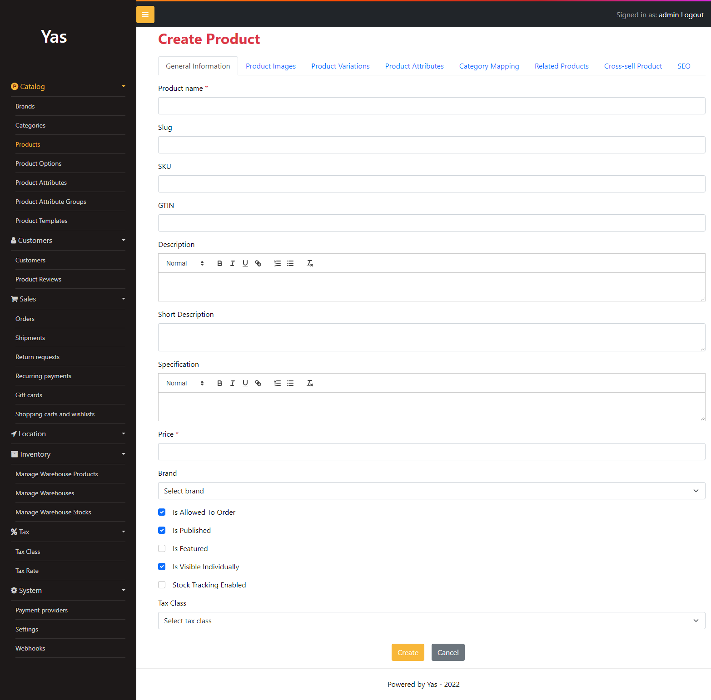
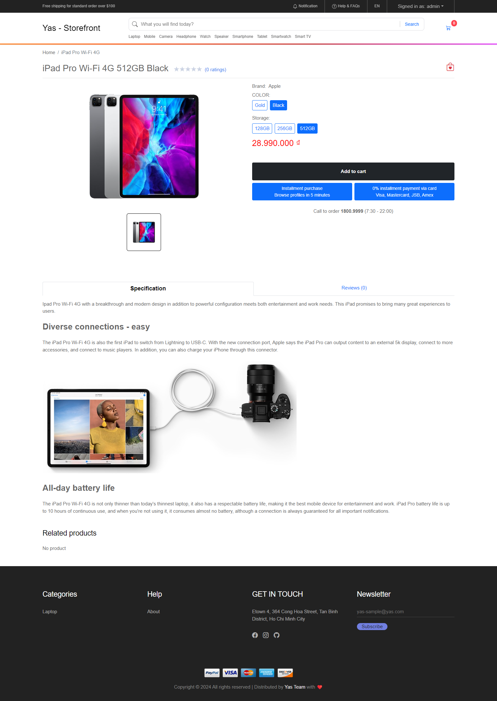
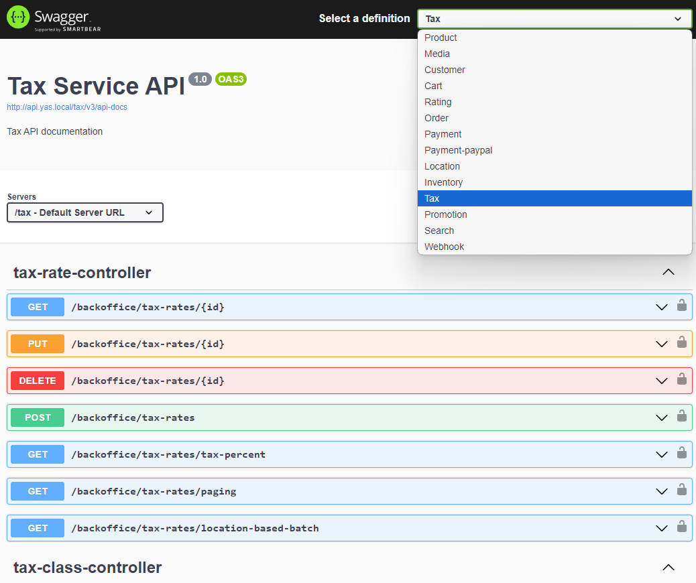
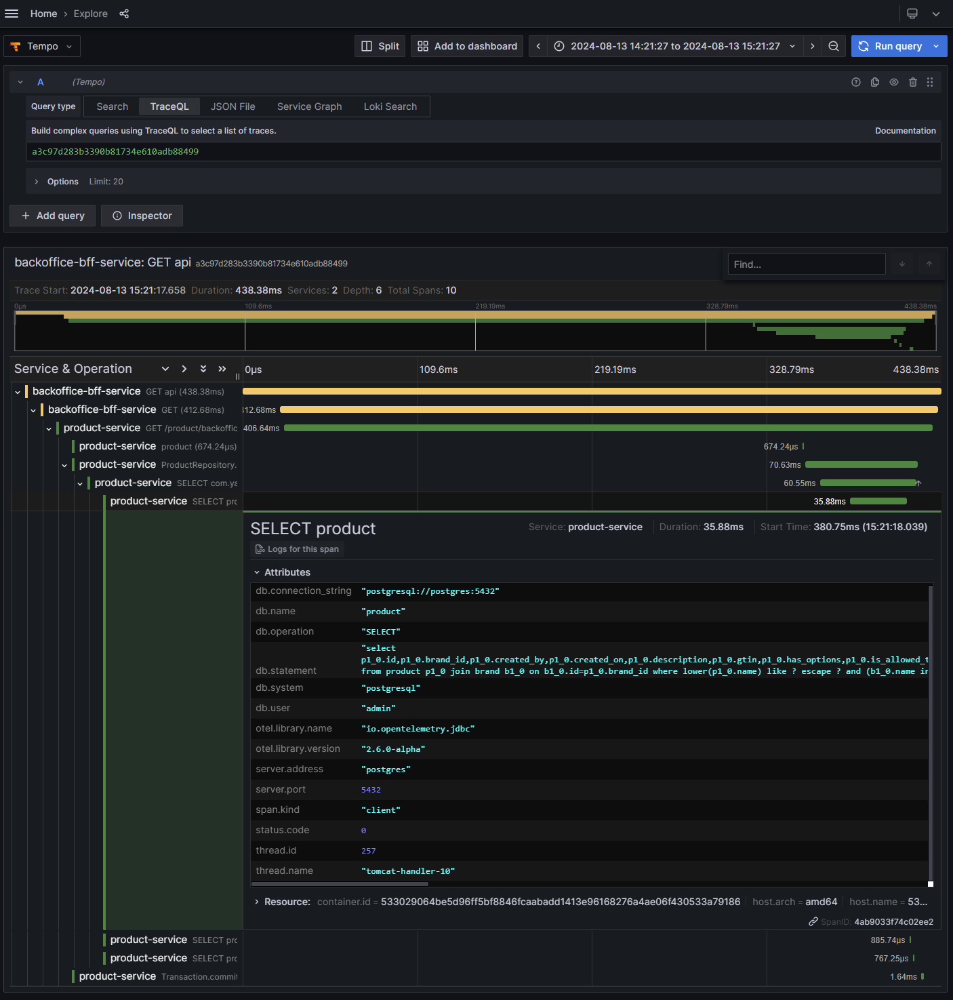
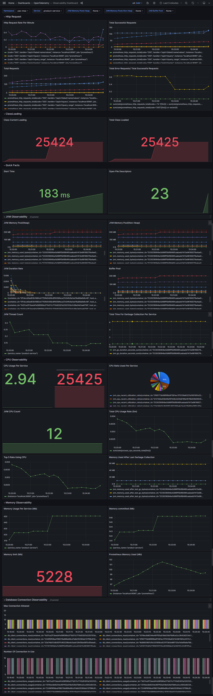

# YAS: Yet Another Shop

YAS is a pet project aim to practice building a typical microservice application in Java

[](https://github.com/nashtech-garage/yas/actions/workflows/gitleaks-check.yaml)
[](https://github.com/nashtech-garage/yas/actions/workflows/storefront-ci.yaml)
[](https://github.com/nashtech-garage/yas/actions/workflows/storefront-bff-ci.yaml)
[](https://github.com/nashtech-garage/yas/actions/workflows/backoffice-ci.yaml)
[](https://github.com/nashtech-garage/yas/actions/workflows/backoffice-bff-ci.yaml)
[](https://github.com/nashtech-garage/yas/actions/workflows/product-ci.yaml)
[](https://github.com/nashtech-garage/yas/actions/workflows/media-ci.yaml)
[](https://github.com/nashtech-garage/yas/actions/workflows/cart-ci.yaml)
[](https://github.com/nashtech-garage/yas/actions/workflows/customer-ci.yaml)
[](https://github.com/nashtech-garage/yas/actions/workflows/rating-ci.yaml)
[](https://github.com/nashtech-garage/yas/actions/workflows/location-ci.yaml)
[](https://github.com/nashtech-garage/yas/actions/workflows/order-ci.yaml)
[](https://github.com/nashtech-garage/yas/actions/workflows/inventory-ci.yaml)
[](https://github.com/nashtech-garage/yas/actions/workflows/tax-ci.yaml)
[](https://github.com/nashtech-garage/yas/actions/workflows/search-ci.yaml)
[](https://github.com/nashtech-garage/yas/actions/workflows/promotion-ci.yaml)
[](https://github.com/nashtech-garage/yas/actions/workflows/payment-ci.yaml)
[](https://github.com/nashtech-garage/yas/actions/workflows/payment-paypal-ci.yaml)
[](https://github.com/nashtech-garage/yas/actions/workflows/webhook-ci.yaml)

## Tentative technologies and frameworks

- Java 21
- Spring boot 3.2
- Testcontainers
- Next.js
- Keycloak
- Kafka
- Elasticsearch
- K8s
- GitHub Actions
- SonarCloud
- OpenTelemetry
- Grafana, Loki, Prometheus, Tempo

## Local development architecture


## Getting started with Docker Compose

1. Get the latest source code
2. Add the following records to your host file: 
```
127.0.0.1 identity
127.0.0.1 api.yas.local
127.0.0.1 pgadmin.yas.local
127.0.0.1 storefront
127.0.0.1 backoffice
127.0.0.1 loki
127.0.0.1 tempo
127.0.0.1 grafana
127.0.0.1 elasticsearch
127.0.0.1 kafka
127.0.0.1 akhq
```
3. Open terminal of your choice, go to `yas` directory, run `docker compose up`, wait for all the containers up and running

> *_Warning:_* To run all the containers, you need a minimum of 16GB of RAM. Otherwise, you can only run the core services with this command `docker compose -f docker-compose.yml up`

4. All the containers up and running then we start source connectors by run script, open any terminal window... go to the YAS root folder and type: ./start-source-connectors.sh
5. Open your browser, now you can access the websites via `http://storefront/`; `http://backoffice/` login with admin/password

> *_Note:_* For the first run, the storefront and the backoffice might not work as expected. Stop all the containers (Ctrl + C) and run docker compose up again.

#### You might also want to explore:
1. `http://pgadmin.yas.local/`. Account login: `admin@yas.com` / admin. Register a server: postgres, port 5432, username admin, password admin. The Postgresql server is also exposed to the host machine: servername: localhost, port: 5432, username: admin, password: admin
2. `http://api.yas.local/swagger-ui/` for all the REST API document of all the services
3. `http://identity/` for Keycloak console, account admin/admin
4. `http://grafana/` for observability: log, trace, matrix
5. `http://elasticsearch/` for calling Elasticsearch APIs

#### About docker-compose files
1. docker-compose.yml for all core services
2. docker-compose.search.yml for search service
3. docker-compose.o11y.yml for observability services

## Deploy to Kubernetes
https://github.com/nashtech-garage/yas/tree/main/k8s/deploy

## Documentation
- [Architecture and components](https://github.com/nashtech-garage/yas/tree/main/docs)
- [Developer guidelines](https://github.com/nashtech-garage/yas/tree/main/docs/developer-guidelines.md)

## Contributing
- Give us a star
- Reporting a bug
- Participate discussions
- Propose new features
- Submit pull requests. If you are new to GitHub, consider to [learn how to contribute to a project through forking](https://docs.github.com/en/get-started/quickstart/contributing-to-projects)

By contributing, you agree that your contributions will be licensed under MIT License. 

## Screenshots

<table>
    <thead>
        <tr>
            <th>Backoffice &amp; Storefront</th>
            <th>Observability</th>
        </tr>
    </thead>
    <tbody>
        <tr valign="top">
            <td>
                
                
                
            </td>
            <td>
                
                
            </td>
        </tr>
    </tbody>
</table>
