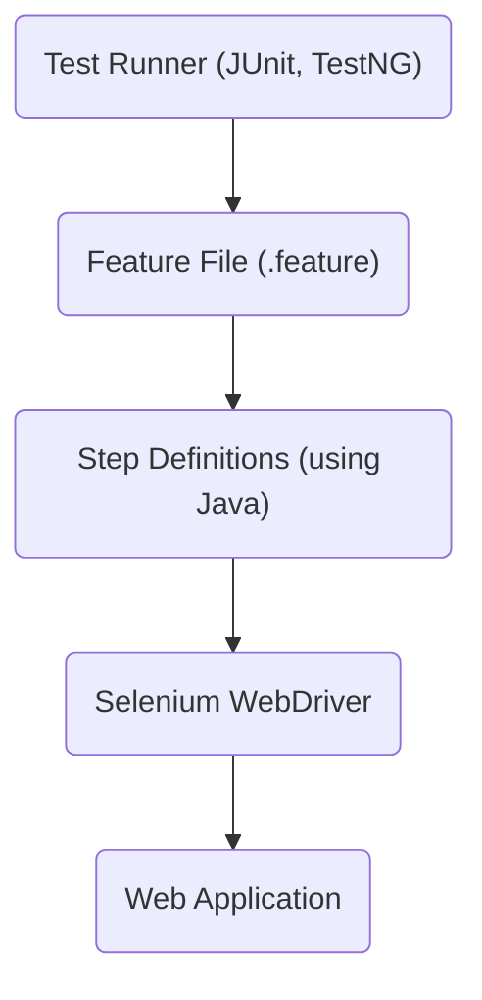

# 🛠️ Automation Project for YAS Application

This project automates tests for the YAS application using modern Java technologies.

## 🧑‍💻 Technologies and Frameworks
- **Java 21**
- **Spring Boot 3.2**
- **Cucumber**
- **Cucumber-Spring**
- **Selenium**
- **Cucumber-JUnit**
- **SonarCloud**

## 🏗️ Local Development Architecture

## 🚀 Getting Started

To run the tests locally, follow the steps below:

### 1. Start the YAS Application
Ensure the YAS application is running in your local environment.

### 2. Running Tests via Maven
You can run the tests in two modes:

- **Normal Mode**: Run the tests normally with the following command:
  ```bash
  mvn clean test
  ```

- **Headless Mode**: 
  To run the tests in headless mode, use the following command:
  ```bash
  mvn clean test -Dheadless
  ```
