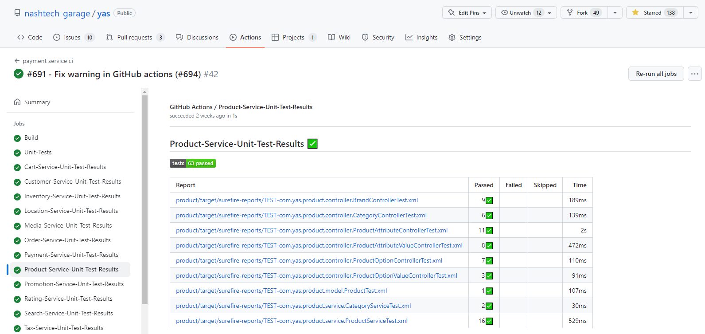
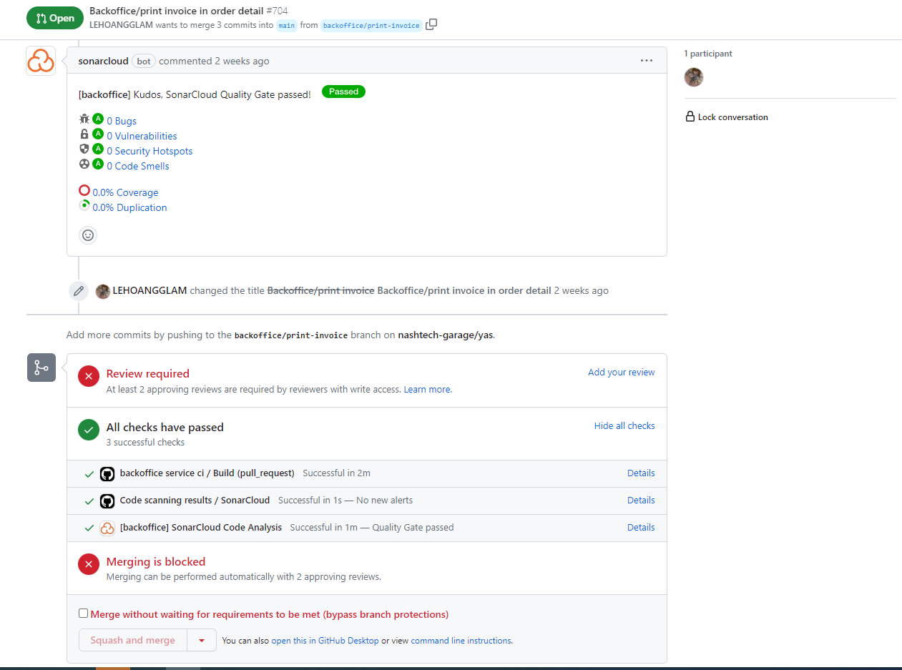
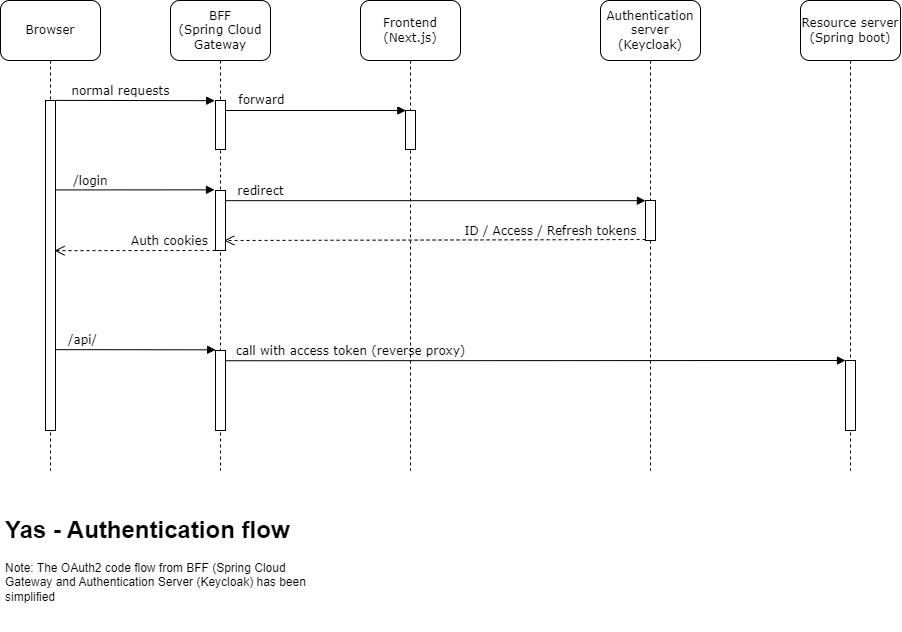
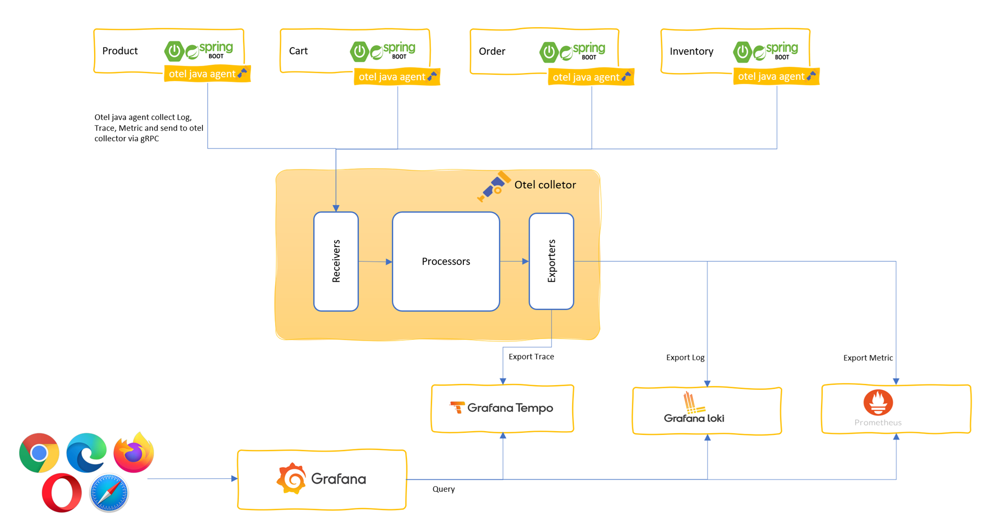
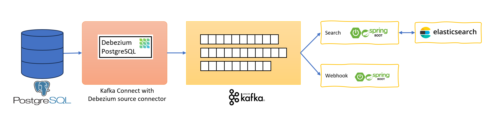

# YAS: Yet Another Shop
YAS is a pet project aim to practice building a typical microservice application in Java
https://github.com/nashtech-garage/yas

## Table of Contents

- [Repo setup](#repo-setup)
- [Continous Interation](#continous-interation)
- [Authentication and Authorization](#authentication-and-authorization)
- [Local development with docker compose](#local-development-with-docker-compose)
- [Observability](#observability)
- [Change Data Capture (CDC) with Debezium](#change-data-capture-cdc-with-debezium)
- [Product searching with Elasticsearch](#product-searching-with-elasticsearch)
- [Duplicating data to improve performance](#duplicating-data-to-improve-performance)
- [Frontend architecture](#frontend-architecture)
- [Kubernetes](#kubernetes)

## Repo setup

The source code of the Yas project is publicly hosted on GitHub as a monorepo, where each microservice has its own folder. There are two common ways to organize the source code for microservices projects: multi-repos and monorepo. Multi-repos means that each microservice has its own repository, while monorepo means that all microservices share a single repository. We chose monorepo for simplicity, as it allows us to have a single issue tracker for the entire project. Some features or bugs may require code changes in multiple microservices, and with monorepo we can make a single commit that covers them all. The code is visible to everyone, so we do not need a separate access control for each microservice.

## Continous Interation

In Yas, we use GitHub Actions to build the continuous integration pipeline. It is totally free for open-source project. All the GitHub Actions workflows are put in `/.github/workflows` folder. Each micro-services will have its own workflow. Let look at the first part of the typical workflow: product

```yaml
name: product service ci

on:
  push:
    branches: [ "main" ]
    paths:
      - "product/**"
      - ".github/workflows/actions/action.yaml"
      - ".github/workflows/product-ci.yaml"
  pull_request:
    branches: [ "main" ]
    paths:
      - "product/**"
      - ".github/workflows/actions/action.yaml"
      - ".github/workflows/product-ci.yaml"
      
  workflow_dispatch:
```

We use the `on` keyword to specify what event will trigger our workflow. Here we trigger the workflow when there are pushes to the main branch. Since we organized the project in a single monorepo, we need to specify the paths that are relavant for each workflow. This way, the workflow will only run when there are changes in those paths. For example, pushing code to the order folders will not trigger the product workflow. We also want to run the workflows on pull requests to make sure that the code changes pass all the requirement before being merged. Finally, with `workflow_dispatch` we enable the workflow can be triggered manually from the GitHub UI.

Next, we will define jobs in our workflow. A GitHub Actions workflow can contain multiple jobs that run in parallel by default. Each job runs inside its own virtual machine (runner) specified by `run-on`. In our case, we only need one job. Within the job we can have multiple steps. Each step is either a shell script or an action. Steps are executed in order and  depend on each other. Since all steps run on the same runner, we can share data from one step to another. For instance, we can have a step that builds our application followed by a step that tests the application that was built.

```yaml
jobs:
  Build:
    runs-on: ubuntu-latest
    steps:
      - uses: actions/checkout@v3
        with:
          fetch-depth: 0  # Shallow clones should be disabled for a better relevancy of analysis
      - uses: ./.github/workflows/actions
      - name: Run Maven Build Command
        run: mvn clean install -DskipTests -f product
      - name: Run Maven Test
        run: mvn test -f product
      - name: Unit Test Results
        uses: dorny/test-reporter@v1
        if: success() || failure()
        with:
          name: Product-Service-Unit-Test-Results
          path: "product/**/surefire-reports/*.xml"
          reporter: java-junit
      - name: Analyze with sonar cloud
        if: ${{ github.event.pull_request.head.repo.full_name == github.repository || github.ref == 'refs/heads/main' }}
        env:
          SONAR_TOKEN: ${{ secrets.SONAR_TOKEN }}
        run: mvn org.sonarsource.scanner.maven:sonar-maven-plugin:sonar -f product
      - name: Log in to the Container registry
        if: ${{ github.ref == 'refs/heads/main' }}
        uses: docker/login-action@v2
        with:
          registry: ghcr.io
          username: ${{ github.actor }}
          password: ${{ secrets.GITHUB_TOKEN }}
      - name: Build and push Docker images
        if: ${{ github.ref == 'refs/heads/main' }}
        uses: docker/build-push-action@v3
        with:
          context: ./product
          push: true
          tags: ghcr.io/nashtech-garage/yas-product:latest
```

The first step in our workflow is checking out the source code. This is done by using the action `actions/checkout` version 3. In the next steps we reuse some actions defined in the https://github.com/nashtech-garage/yas/blob/main/.github/workflows/actions/action.yaml which will setup Java SDK 17 and some caching to improve the build time. We build the source code by run Maven command; run test, and export test result to be showed in the GitHub UI. There is a limitation in the case that if there are many GitHub Action workflows are triggered by one git push, the test report is showed only in the first workflow. The issue is reported here https://github.com/dorny/test-reporter/issues/67




We use SonarCloud to analyze the source code. SonarCloud is free for open-source projects. To authenticate with SonarCloud, we will need the SONAR_TOKEN. After registering an account on SonarCloud and add our GitHub repo to SonarCloud, we can get the SONAR_TOKEN. This SONAR_TOKEN needs to be added to repository secret in GitHub. In the repository, go to Settings –> Security –> Secrets and variables –> Actions and add new repository secret. Because the security reason, the SONAR_TOKEN is not available in pull requests from forked repos. We added the `if:` statement so that this step only run on the main branch or pull requests created from within our repo not from a fork. The SonarCloud bot will add the scanning report to every pull request as image below.




The final steps are login to GitHub Packages, build and push the docker images. We only build and push docker images when the workflow is run in the main branch not on pull requests.

To improve the code quality of the project, we have configured that every pull request needs to pass certain conditions: build success, pass sonar gate and have at least 2 developers review and approved, otherwise the Merge button will be blocked.

## Authentication and Authorization

Authentication is a challenging task for many developers who want to secure their browser-based applications, especially with SPAs. Traditionally, websites use cookies to authenticate user requests, but with SPAs, people moved to using tokens for authentication. Let's review how cookies and token authentication work and what are the differences between them.

#### Cookies-based authentication

Cookies are small pieces of data created by a web server and placed on the user’s web browser. The browser will automatically send them for subsequence requests in the same domain. Authentication cookies are used by web servers to verify that a user is logged in.

##### The advantages

- Cookies are managed by the browser. It is automatic
- You can prevent client JavaScript to read them by setting the HttpOnly flag to true. This will prevent cross-site scripting (XSS) attacks on your application to steal them or manipulate them

##### The downside

- It is vulnerable to cross-site request forgery attacks (XSRF or CSRF). Although there are workarounds to mitigate this threat, the risk still there. Recently, the major browsers have introduced SameSite attribute that allow us to decide whether cookies should be sent to third-party websites using the Strict or Lax setting.
- Cookies is not friendly with REST APIs

#### Token-based authentication

The web browser will receive a token from the web server after it has validated the user’s login detail. Then in subsequent requests, that token will be sent to server as an authentication header.

##### The advantages

- Unlike cookies, token is not automatically received or sent to server. It has to be handled by JavaScript. Therefore, it is invulnerable to cross-site request forgery attacks (CSRF)
- Token is friendly with REST APIs

##### The disadvantages

- Because the token must be read and sent by JavaScript, they are vulnerable to cross-site scripting (XSS)
- Granting, storing and renewing tokens is complicated. In 2012, when the OAuth2 RFC was released, the implicit flow was the recommended way for SPAs. However, it has many drawbacks, the main concern being that the access token is delivered to browser via a query string in the redirect URI, which is visible in the browser’s address bar and in the browsers history. The access token can also be maliciously injected. The implicit flow is deprecated by code flow with PKCE. Regardless of any approach, the token has to be stored in the browser, which is a risk.

In Yas, we use SameSite cookies and tokens together with the backend for frontend (BFF) pattern with Spring Cloud Gateway. We also use Keycloak as the authentication provider.



The BFF acts as a reverse proxy for both Next.js and resource servers behind it. The authentication between browser and BFF is done by cookies. The BFF plays the role of OAuth2 client and authenticate with Keycloak by OAuth2 code flow with spring-boot-starter-oauth2-client. When it receives the access token, BFF keeps it in memory and automatically appends it along with API requests to resource servers. With this implementation, we can eliminate the risk of storing token in the browsers. Renewing tokens is also handled automatically by the OAuth2 client. Below is an excerpt of the pom.xml of the backoffice-bff

```xml
<dependency>
	<groupId>org.springframework.cloud</groupId>
	<artifactId>spring-cloud-starter-gateway</artifactId>
</dependency>
<dependency>
	<groupId>org.springframework.boot</groupId>
	<artifactId>spring-boot-starter-oauth2-client</artifactId>
</dependency>
```
And this is the Spring Cloud configuration

```yaml
spring:
  application:
    name: backoffice-bff
  security:
    oauth2:
      client:
        provider:
          keycloak:
            issuer-uri: http://identity/realms/Yas
        registration:
          api-client:
            provider: keycloak
            client-id: backoffice-bff
            client-secret: ********************
            scope: openid, profile, email, roles
  cloud:
    gateway:
      routes:
        - id: api
          uri: http://api.yas.local
          predicates:
            - Path=/api/**
          filters:
            - RewritePath=/api/(?<segment>.*), /$\{segment}
            - TokenRelay=
        - id: nextjs
          uri: http://localhost:3000
          predicates:
            - Path=/**
```

## Local development with docker compose

Because there many services, we created muliple docker compose file.

- docker-compose.yml for all core services
- docker-compose.search.yml for search service
- docker-compose.o11y.yml for observability services

Common environment variables are defined in .env at the root of the repo. In that file we also set the `COMPOSE_FILE=docker-compose.yml:docker-compose.search.yml:docker-compose.o11y.yml` so that it will run all the services when you run docker compose up. You can run each each docker file separately by `docker compose -f [docker compose file] up`.

All services will be in the same network named yas-network. 

## Observability



In yas, we use OpenTelemetry Java Agent which is attacthed to Spring Boot applications to collect OpenTelemetry data including Log, Trace and Metric and send them all to an OpenTelemetry Collector that run as a container. In the Otel collector we will do some transformation see https://github.com/nashtech-garage/yas/blob/main/docker/otel-collector/otelcol-config.yml

 - The log data then sent to Grafana Loki
 - The trace data sent to Grafana Tempo
 - The metric data sent to Prometheus

We use the Grafana to view the observability data

## Change Data Capture (CDC) with Debezium



We use debezium to capture the change in some tables, those changes will be pushed to kafka topics. There is background job that listen to those topics, receive the ids of products having data changed, call to product rest API to get product information and update to elastic search.

Debezium acts as a source connector of Kafka connect. It captures row-level changes that insert, update, and delete database content and that were committed to a PostgreSQL database. The connector generates data change event records and streams them to Kafka topics

## Product searching with Elasticsearch

## Duplicating data to improve performance

## Frontend architecture 

## Kubernetes