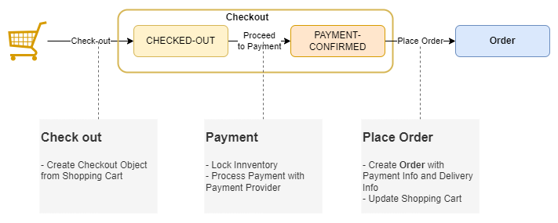

# Order Processing flow

## Overview

*Checkout* will be created based on the product items on *Shopping Cart*.

*Order* will be created based on the *Checkout*.

**Design choice notes:** 
- We decided to create an *Order* only after *Payment* for it has been confirmed. By doing this, the fulfilment cycle can be started immediately after an *Order* has been created, minimizing possible confusion later on.
## Checkout Flow

### Checkout Lifecycle

When the user begins the checkout process, the `Shopping Cart` is sealed and saved as a snapshot in a `Checkout` object, allowing the user to focus on making the decision to place an order. The `Checkout` object will also contains information collected before the order is placed.
 - It will be created with the `CHECKED_OUT` status when the user start the checkout process by clicking the *"Proceed to checkout"* button on the *Cart page*. At this stage, the `Checkout` object will only contains the products' types and quantities that the customer wants to order.
 - The customer will then update the `Checkout` object with their desired shipping address, shipping provider, and payment method information. 
 - After all the information required has been fulfilled and reflects the customer desired order, the payment amount with detailed breakdown can be calculated and review by the customer after which they can confirm, and start the payment process. This will change that state of the `Checkout` object to `PAYMENT_PROCESSING`.
 - After the payment has been processed and confirmed by the `payment-confirmed` action, the `Checkout` object will be changed to the `PAYMENT_CONFIRMED` state. At this stage, the system can start the `create-order` process, which will place the necessary block on the inventory, and create a new order for the customer.
 - In case some products in the `Checkout` object is out-of-stock or the `process-payment` action encounters an error, the `Checkout` object's status will be revert back to `CHECKED_OUT`. The last encountered error will also be attached to the `Checkout` object
 - After an order has been placed, the `Checkout`    has served its purpose, thus its state will be changed to `FULFILLED`. 

### Checkout flow

The Checkout flow happens between when the user begin the checkout process and the start of the payment process. This process includes:
- User start this process by navigating to the *Cart page* and click on *"Proceed to check out"* after choosing all the desired items and their amount. The system will start the checkout process by creating a `Checkout` object by copying the user's current cart and then clear the cart. 
- The system then prompt the user for additional information that is necessary for the order placing process. This includes showing the customer available shipping provider, payment provider, their address saved by the system, as well as a form for customer to input a new address should they need to.
- The user will then input the requested information into the system and continually update their `Checkout` object. After all the necessary information for the object has been inputed, an event to calculate total order amount, delivery fee, and tax amount will be triggered and the result will be displayed to the customer.
- The user can iteratively change their order information at this step. After each change, the order amount, delivery fee, and tax amount will be recalculated and displayed to them.  
- After the customer is satisfied with all their information, they will confirm by clicking *"Proceed to payment"* at which point the system will start the payment process for the order.

### Payment flow

The payment flow is the point at which the customer confirm their payment for the order so that the system can place their order and start the fulfilment cycle. This process can be divided into 3 phases including:

- The first phase's goal is to create an internal `PaymentCheckout` object that will keep track of the payment status for the order. This phase includes the following steps:
  - The Customer will start this phase by clicking *"Proceed to payment"* on the *Checkout page*. This will send a request to start the payment process to the `Order Service`.
  - The `Order Service` will then request the `Inventory service` to place a reservation on the products requested in the `Checkout` object.
  - In case the reservation process fail due to some products being out of stock, the `Inventory Service` will return the error to the `Order Service` which will forward it to `Storefront`. The `Storefront` will then notified the Customer and stop the payment process.
  - If the reservation process succeed, the `Order Service` will trigger the creation of a `CheckoutPayment` object which will be managed by the `Payment Service`. Information about this object will be send back to the `Storefront` page which marks the end of phase 1. At the end of this phase, a `CheckoutPayment` object for the order must have been created.
  

- The second phase of the payment process will concern the communication with the external payment provider and creating a `Checkout` object on their server to serve as a basis for the Payment process. This phase includes the following steps:
    - The creation of an internal `CheckoutPayment` object will be captured with a CDC event which will trigger the start of this phase.
    - If the created `CheckoutPayment`'s `payment_type` is not `COD` and its `status` is `NEW`, the `Payment Service` will then contact the external payment provider to create a Checkout object on their server with a reference id which will be sent back to the `Payment Service`.
    - The `Payment Service` will then update this id into the `CheckoutPayment` object and change its status to `PROCESSING`.
    - At the end of this stage, the `CheckoutPayment` object status need to be changed to `PROCESSING`, and in case `payment_type` is not `COD`, the `CheckoutPayment` object should contains the external payment provider's `Checkout`'s id.

- The final phase of the payment process will concern the payment completion and placing order into our system. This phase includes the steps below:
  - After receiving the `CheckoutPayment` object id from phase 1, the `Storefront` page will periodically query the `Payment Service` for the status of the `CheckoutPayment` object. This will be repeated until the `CheckoutPayment`'s status changed to `PROCESSING`.
  - The `Storefront` page will then navigate the user to the external payment provider payment page using the provided external payment provider's `Checkout` object's id. The customer can execute the payment on the external provider page.
  - After the payment has been processed by the external provider, they will navigate the customer back to the *Payment confirmation page* of our `Storefront`. 
  - At the same time, the external payment provider will also notify our `Backend` through a webhook registered to them. This webhook will then trigger the `Payment Completed` chain in our system, change the `CheckoutPayment` object status to `PAYMENT_COMPLETED`, notify the customer and create an `Order` object with the `PAYMENT_CONFIRMED` status in our system.
  - After this phase, an `Order` object must be created in our system. This object will be the starting point for the order fulfilment cycle.
- After the `Order` object has been created, we will send a notification to the customer, then the `Storefront` can request and display the `Order` info to Customer.

## Order Processing

The Order will be created after the payment processed is finished and will be the entry point for the fulfilment cycle.

### Order Lifecycle

- After the payment has been confirmed for the order by the `Payment Service`, an `Order` with `PAYMENT_CONFIRMED` status will be created from the relevant `Checkout` object . 
- At this point, the warehouse workers can trigger the action `prepare-parcel` after the have package the order items, which will change the order status to `READY_TO_SHIP`, at which point the desired delivery provider can be contacted to come and pick up the parcel
- After the parcel has been picked up, the action `ship-parcel` will be triggered and the `Order`'s state will be changed to `SHIPPED`.
- When the shipper reach the destination, they can trigger the action `deliver-parcel`, which will change the `Order`'s status to `RECEIVED`, at which point the customer can trigger the `confirm-receipt` action and change the `Order`'s status to `CONFIRMED`, which completes the order.
- During the shipping process (when the order is at the `SHIPPED` state), the shipper can also trigger the `report-failure` action, which will change the order status to `SHIPMENT_FAILED` and start the refund process to refund the payment to the customer.
- At any point before the `Order` reached the `RECEIVED` state, the customer can trigger the `cancel` action, which will notify the shop of their cancel request and change the `Order` state to `CANCEL_REQUESTED`.
- At this point, the shop will start the `refund` action and start the refunding process as well as recollect the shipment as required.
- After the `refund-confirm` action triggered to confirm that the refund process has finished, the order status will be changed to `CANCELLED`. 
