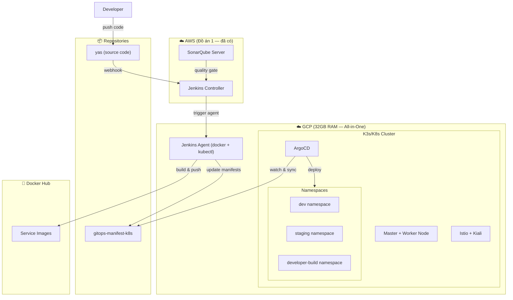
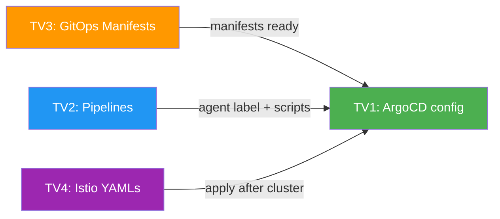

# 🚀 Đồ Án 2 — Kế Hoạch Triển Khai CD + GitOps + Service Mesh

## I. Tổng Quan Kiến Trúc



> [!IMPORTANT]
> **Nguyên tắc:** Mỗi thành viên làm việc trên scope riêng biệt, output rõ ràng, không block lẫn nhau.

---

## II. Phân Chia Công Việc — 4 Thành Viên

---

### 👤 Thành Viên 1 (TV1): Hạ Tầng GCP + K8s Cluster + ArgoCD

**Scope:** Dựng toàn bộ hạ tầng K8s trên GCP, cài ArgoCD, cấu hình Jenkins Agent.

#### Phase 1 — Provision GCP Server
- [ ] Tạo VM instance GCP (e2-standard-8 hoặc tương đương, 32GB RAM, Ubuntu 22.04)
- [ ] Cấu hình firewall rules: mở port `6443` (K8s API), `80/443` (Ingress), `30000-32767` (NodePort), `50000` (Jenkins Agent JNLP)
- [ ] Cấu hình SSH key, tạo user riêng cho automation
- [ ] Cài đặt Docker, `kubectl`, `helm` trên VM

#### Phase 2 — K8s Cluster Setup
- [ ] Cài đặt K3s single-node (master + worker cùng node) với lệnh: `curl -sfL https://get.k3s.io | sh -`
- [ ] Verify cluster: `kubectl get nodes` → status Ready
- [ ] Tạo 3 namespaces: `dev`, `staging`, `developer-build`
- [ ] Tạo `ImagePullSecret` cho Docker Hub trong cả 3 namespaces
- [ ] Tạo `kubeconfig` file để Jenkins Agent sử dụng (export và lưu credential)

#### Phase 3 — ArgoCD Installation
- [ ] Cài ArgoCD bằng Helm vào namespace `argocd`
- [ ] Expose ArgoCD Server qua NodePort hoặc `kubectl port-forward`
- [ ] Đổi admin password, tạo user cho team
- [ ] Cấu hình ArgoCD connect tới repo `gitops-manifest-k8s` (SSH key hoặc HTTPS token)
- [ ] Tạo ArgoCD Application cho namespace `dev` (auto-sync enabled)
- [ ] Tạo ArgoCD Application cho namespace `staging` (manual sync hoặc auto)
- [ ] Test: thay đổi manifest trong gitops repo → ArgoCD tự sync → pods deploy thành công

#### Phase 4 — Jenkins Agent trên GCP
- [ ] Cài đặt Java 21 (JRE) trên GCP VM
- [ ] Cài Jenkins Agent (JNLP) — connect về Jenkins Controller trên AWS
- [ ] Đặt label agent: `gcp-k8s-agent`
- [ ] Cài thêm tools trên agent: `docker`, `kubectl`, `git`, `maven`, `yq`
- [ ] Test kết nối: Jenkins Controller (AWS) trigger job → chạy trên GCP agent thành công

#### Deliverables
- [ ] GCP VM running K3s cluster (1 node all-in-one)
- [ ] ArgoCD accessible + connected to gitops repo
- [ ] Jenkins Agent online với label `gcp-k8s-agent`
- [ ] Screenshot các bước setup cho báo cáo
- [ ] README hướng dẫn setup hạ tầng

---

### 👤 Thành Viên 2 (TV2): CI/CD Pipelines (Jenkins)

**Scope:** Viết tất cả Jenkinsfile/Pipeline cho các job: CI build image, `developer_build`, cleanup job, dev/staging triggers.

> [!NOTE]
> TV2 làm việc hoàn toàn trên Jenkins Controller (AWS) + viết Jenkinsfile. Không cần chờ TV1 dựng xong hạ tầng — chỉ cần thống nhất convention (label agent, namespace names, image naming).

#### Convention thống nhất trước
```
Docker Hub:    bingsu1103/<service>:<tag>
Agent label:   gcp-k8s-agent
Namespaces:    dev, staging, developer-build
GitOps repo:   gitops-manifest-k8s
```

#### Phase 1 — CI Pipeline: Build & Push Image (Yêu cầu 3)
- [ ] Tạo `Jenkinsfile.ci` — Multibranch Pipeline
- [ ] Khi commit vào bất kỳ branch → detect changed services (monorepo)
- [ ] Cho mỗi service thay đổi: `docker build` → tag = `<commit-id-short>` → `docker push bingsu1103/<service>:<commit-id>`
- [ ] Push thêm tag `latest` nếu branch là `main`
- [ ] Tích hợp SonarQube scan (gọi qua AWS SonarQube server)
- [ ] Gitleaks + Snyk scan (tái sử dụng từ Đồ án 1)
- [ ] Publish test results + JaCoCo coverage

#### Phase 2 — Job `developer_build` (Yêu cầu 4)
- [ ] Tạo Jenkins Pipeline job tên `developer_build`
- [ ] Parameterized build: mỗi service có 1 String parameter (default = `main`)
- [ ] Logic pipeline:
  - Với mỗi service: nếu branch ≠ `main` → lấy commit cuối cùng của branch đó → image tag = commit id
  - Nếu branch = `main` → image tag = `latest`
- [ ] Build image cho services có branch ≠ main
- [ ] Deploy vào namespace `developer-build` bằng `kubectl apply` hoặc cập nhật gitops manifest
- [ ] Service type = **NodePort** để developer truy cập test
- [ ] Output: In ra bảng `service → nodeIP:nodePort` sau khi deploy

#### Phase 3 — Job Cleanup (Yêu cầu 5)
- [ ] Tạo Jenkins job `developer_build_cleanup`
- [ ] Xóa toàn bộ resources trong namespace `developer-build`: `kubectl delete all --all -n developer-build`
- [ ] Giữ lại namespace, chỉ xóa workloads

#### Phase 4 — Trigger ArgoCD cho Dev & Staging (Nâng cao 1)
- [ ] **Dev trigger:** Khi `main` branch thay đổi → CI build images → update image tag trong gitops repo (`environments/dev/`) → ArgoCD auto-sync deploy
- [ ] **Staging trigger:** Khi có tag `v*` trên `main` → CI build images với tag version → update gitops repo (`environments/staging/`) → ArgoCD sync
- [ ] Script `update-gitops-manifest.sh`: clone gitops repo → update `kustomization.yaml` image tags → commit & push
- [ ] Webhook hoặc polling từ Jenkins → trigger pipeline

#### Deliverables
- [ ] `Jenkinsfile.ci` — CI multibranch pipeline
- [ ] `Jenkinsfile.developer-build` — developer_build job
- [ ] `Jenkinsfile.cleanup` — cleanup job
- [ ] `scripts/update-gitops-manifest.sh`
- [ ] Screenshot Jenkins jobs configuration + demo run
- [ ] README hướng dẫn sử dụng từng job

---

### 👤 Thành Viên 3 (TV3): GitOps Manifests (Kustomize)

**Scope:** Tạo toàn bộ K8s manifests trong repo `gitops-manifest-k8s` sử dụng Kustomize, cho cả `dev`, `staging`, `developer-build`.

> [!NOTE]
> TV3 làm việc trên repo riêng `gitops-manifest-k8s`. Hoàn toàn độc lập, chỉ cần biết danh sách services và image naming convention.

#### Danh sách 19 microservices
```
media, product, order, inventory, payment, promotion, rating, delivery,
sampledata, recommendation, customer, location, cart, tax, search, webhook,
backoffice-bff, storefront-bff, payment-paypal
```

#### Phase 1 — Base Manifests
- [ ] Tạo cấu trúc thư mục:
  ```
  gitops-manifest-k8s/
  ├── base/
  │   ├── kustomization.yaml
  │   ├── media/
  │   │   ├── deployment.yaml
  │   │   └── service.yaml
  │   ├── product/
  │   │   ├── deployment.yaml
  │   │   └── service.yaml
  │   └── ... (19 services)
  ├── environments/
  │   ├── dev/
  │   │   └── kustomization.yaml
  │   ├── staging/
  │   │   └── kustomization.yaml
  │   └── developer-build/
  │       └── kustomization.yaml
  └── infrastructure/
      ├── keycloak/
      ├── postgres/
      ├── kafka/
      └── elasticsearch/
  ```
- [ ] Mỗi service trong `base/`: Deployment (1 replica, image `bingsu1103/<svc>:latest`) + ClusterIP Service
- [ ] Base `kustomization.yaml` liệt kê tất cả resources

#### Phase 2 — Environment Overlays
- [ ] `environments/dev/kustomization.yaml`:
  - Namespace: `dev`
  - Labels: `environment: dev`
  - Image tags override (cho ArgoCD/Jenkins update)
- [ ] `environments/staging/kustomization.yaml`:
  - Namespace: `staging`
  - Labels: `environment: staging`
  - Replicas có thể > 1
- [ ] `environments/developer-build/kustomization.yaml`:
  - Namespace: `developer-build`
  - Service type patch: **NodePort** cho tất cả services
  - Image tags override riêng

#### Phase 3 — Infrastructure Manifests
- [ ] Viết manifests cho Keycloak (Deployment + Service + PersistentVolume)
- [ ] PostgreSQL StatefulSet + Service + ConfigMap (init script)
- [ ] Kafka + Zookeeper (hoặc dùng Helm chart reference)
- [ ] Elasticsearch (optional, nếu search service cần)
- [ ] Redis (cho session/cache)

#### Phase 4 — Validation
- [ ] Dry-run: `kubectl kustomize environments/dev/` → verify output YAML hợp lệ
- [ ] Dry-run: `kubectl kustomize environments/staging/`
- [ ] Dry-run: `kubectl kustomize environments/developer-build/`
- [ ] Commit và push lên repo, verify ArgoCD detect được

#### Deliverables
- [ ] Repo `gitops-manifest-k8s` hoàn chỉnh với base + 3 environments
- [ ] Infrastructure manifests
- [ ] README giải thích cấu trúc Kustomize
- [ ] Screenshot `kustomize build` output

---

### 👤 Thành Viên 4 (TV4): Service Mesh (Istio) + Security + Báo Cáo

**Scope:** Cài đặt Istio Service Mesh, cấu hình mTLS, Authorization Policy, Retry Policy, Kiali visualization, và viết báo cáo tổng hợp.

> [!NOTE]
> TV4 chuẩn bị sẵn tất cả YAML manifests cho Istio. Khi cluster ready (TV1) → apply vào. Phần viết YAML hoàn toàn độc lập.

#### Phase 1 — Istio Installation (sau khi TV1 setup xong cluster)
- [ ] Cài Istio bằng `istioctl install --set profile=demo`
- [ ] Enable sidecar injection cho namespaces: `kubectl label namespace dev istio-injection=enabled`
- [ ] Làm tương tự cho `staging` và `developer-build`
- [ ] Cài Kiali: `kubectl apply -f https://raw.githubusercontent.com/istio/istio/release-1.20/samples/addons/kiali.yaml`
- [ ] Cài Prometheus + Grafana addons cho Kiali (Istio bundled)

#### Phase 2 — mTLS Configuration (Nâng cao 2.1)
- [ ] Tạo `PeerAuthentication` — enforce mTLS toàn mesh:
  ```yaml
  # istio/peer-authentication.yaml
  apiVersion: security.istio.io/v1beta1
  kind: PeerAuthentication
  metadata:
    name: default
    namespace: istio-system
  spec:
    mtls:
      mode: STRICT
  ```
- [ ] Tạo `DestinationRule` cho từng service — enable mTLS:
  ```yaml
  apiVersion: networking.istio.io/v1beta1
  kind: DestinationRule
  metadata:
    name: default
    namespace: dev
  spec:
    host: "*.dev.svc.cluster.local"
    trafficPolicy:
      tls:
        mode: ISTIO_MUTUAL
  ```
- [ ] Verify: `istioctl x describe pod <pod-name>` → confirm mTLS active

#### Phase 3 — Authorization Policy (Nâng cao 2.3)
- [ ] Deny-all policy mặc định:
  ```yaml
  apiVersion: security.istio.io/v1
  kind: AuthorizationPolicy
  metadata:
    name: deny-all
    namespace: dev
  spec: {}
  ```
- [ ] Allow policies cho từng service pair hợp lệ (ví dụ):
  - `storefront-bff` → `product`, `media`, `cart`, `order`, `customer`, `rating`
  - `backoffice-bff` → `product`, `media`, `order`, `inventory`, `promotion`
  - `order` → `inventory`, `payment`, `customer`, `cart`
  - (và các cặp khác theo kiến trúc YAS)
- [ ] Test: `kubectl exec -n dev <pod-A> -- curl -v http://<service-B>.dev:8080/` → expect 200 (allowed) hoặc 403 (denied)

#### Phase 4 — Retry Policy (Nâng cao 2.3)
- [ ] Tạo VirtualService với retry config:
  ```yaml
  apiVersion: networking.istio.io/v1beta1
  kind: VirtualService
  metadata:
    name: product-vs
    namespace: dev
  spec:
    hosts:
    - product
    http:
    - route:
      - destination:
          host: product
      retries:
        attempts: 3
        perTryTimeout: 2s
        retryOn: 5xx,reset,connect-failure
  ```
- [ ] Áp dụng cho các critical services: product, order, payment, cart, inventory
- [ ] Test kịch bản: inject fault → observe retry behavior

#### Phase 5 — Kiali Topology + Documentation
- [ ] Access Kiali dashboard: `istioctl dashboard kiali`
- [ ] Generate traffic: curl các endpoints từ bên ngoài
- [ ] Screenshot topology graph từ Kiali
- [ ] Vẽ flow chart các service connections
- [ ] Viết giải thích cho từng flow

#### Phase 6 — Báo Cáo Tổng Hợp
- [ ] Thu thập screenshots từ TV1, TV2, TV3
- [ ] Viết báo cáo `.docx` theo format `<MSSV1>_<MSSV2>_<MSSV3>_<MSSV4>.docx`
- [ ] Sections: Giới thiệu → Kiến trúc → CI/CD Pipeline → GitOps → Service Mesh → Kết luận
- [ ] Đính kèm test logs (curl results, retry evidence)
- [ ] Review và format báo cáo cuối cùng

#### Deliverables
- [ ] Thư mục `istio/` chứa tất cả YAML manifests (PeerAuth, AuthzPolicy, VirtualService, DestinationRule)
- [ ] Screenshots Kiali topology
- [ ] Test plan + test logs
- [ ] Báo cáo tổng hợp hoàn chỉnh
- [ ] README hướng dẫn setup Istio

---

## III. Timeline Đề Xuất (3 Tuần)

| Tuần | TV1 (Hạ tầng) | TV2 (Pipelines) | TV3 (Manifests) | TV4 (Mesh + Report) |
|------|---------------|-----------------|-----------------|---------------------|
| **1** | GCP VM + K3s + ArgoCD | Jenkinsfile.ci + developer_build | Base manifests (19 svc) | Viết Istio YAML manifests |
| **2** | Jenkins Agent + test | Cleanup job + Dev/Staging triggers | Environment overlays + Infra | Cài Istio + apply policies |
| **3** | Fix issues + hỗ trợ | Test E2E toàn pipeline | Validate + fix manifests | Test + Kiali + Báo cáo |

---

## IV. Điểm Số Mapping

| Yêu cầu | Điểm | Người phụ trách |
|----------|-------|-----------------|
| K8S Cluster (YC2) | Cơ bản | TV1 |
| CI — Image Build & Push (YC3) | Cơ bản | TV2 |
| Job `developer_build` (YC4) | Cơ bản | TV2 + TV3 |
| Job Cleanup (YC5) | Cơ bản | TV2 |
| ArgoCD dev + staging (NC1) | +2đ | TV1 + TV2 + TV3 |
| Service Mesh — mTLS + AuthzPolicy + Retry (NC2) | +2đ | TV4 |
| **Tổng tối đa** | **10đ** | |

---

## V. Dependencies & Conventions



> [!TIP]
> **Tuần 1** mọi người làm song song hoàn toàn. **Tuần 2** bắt đầu integration test. TV1 là điểm hội tụ — khi cluster ready, các TV khác apply lên.

### Conventions cần thống nhất ngày 1:
| Item | Convention |
|------|-----------|
| Docker Hub account | `bingsu1103` |
| Image naming | `bingsu1103/<service-name>:<tag>` |
| Tag strategy | `main` branch → `latest`, feature branch → `<short-commit-id>`, release → `v1.2.3` |
| Jenkins Agent label | `gcp-k8s-agent` |
| Namespaces | `dev`, `staging`, `developer-build`, `argocd`, `istio-system` |
| GitOps repo | `gitops-manifest-k8s` |
| Kustomize structure | `base/` + `environments/{dev,staging,developer-build}/` |
