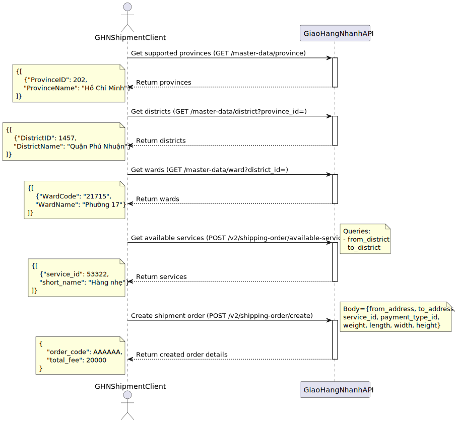

# Giao Hang Nhanh API Overview

## Main Functionalities

The GHN API provides several key features to integrate shipping services into our system:

- **Create order:** Initiate a shipment order from our system to GHN.
- **Cancel order:** Cancel an existing shipment order.
- **Calculate delivery fee:** Retrieve shipping costs based on pickup and delivery locations.
- **Estimate delivery time:** Estimate when the package will be delivered.
- **Pick delivery work shift:** Select specific work shifts for pickup.
- **Print shipping invoice/label:** Generate labels for shipments.
- **Get supported locations:** Retrieve available provinces, districts, and wards in GHN’s format (IDs, codes).
- **Webhooks for shipment status updates:** Receive real-time shipment status updates via webhooks (requires a valid URL for GHN to send notifications).

## Main Flow

### 1. Create Order

To create a new shipment order, we need to provide the following information:

- **Pickup location (shop location)**: The address where the carrier will pick up the parcel. This must be formatted according to GHN’s location codes (province, district, ward).
- **Delivery location**: The buyer’s address where the package will be delivered.
- **Parcel details**: Information such as total dimensions (length, width, height), weight, items being shipped, and any cash-on-delivery (COD) amount.
- **Service type**: GHN offers various service types, such as fast delivery or cost-effective shipping. We will need to choose one based on the seller’s preference.

**Steps to Create a Shipment Order:**

Assumed that we already have the product information that need to be shipped, here’re the main steps to create a new shipment order:

1. Call GHN’s address APIs (for **provinces, districts, and wards**) to convert the seller’s pickup address and buyer’s delivery address into GHN’s required format (using location IDs or codes).

2. Call the Service API to get a list of **available delivery services**. This step checks which service types support both the seller’s (pickup) and buyer’s (delivery) locations.

3. With the addresses and chosen service type, make a call to the Order API to create the shipment order.



## API Details

This section will outline the necessary API parameters, request and response formats.

**Base URL**:

```bash
https://dev-online-gateway.ghn.vn/shiip/public-api
```

<!-- **Postman**:

- [Collection](./GHN%20APIs.postman_collection.json)
- [Environment](./GHN%20Env.postman_environment.json) -->

### Create Order

**Endpoint:** `POST /v2/shipping-order/create`

**Request Headers**

- `Token`: The GHN API token for authentication.
- `ShopId`: The ID of the shop. This shop's location will be used as the pickup address if no other address is provided in the request body.

**Request Body**

| Parameter            | Type      | Required | Description                                                                                                                                                                                                                                                         |
|----------------------|-----------|----------|---------------------------------------------------------------------------------------------------------------------------------------------------------------------------------------------------------------------------------------------------------------------|
| `from_name`          | `string`  | Yes      | The name of the sender (typically the shop or warehouse contact person)                                                                                                                                                                                             |
| `from_phone`         | `string`  | Yes      | The phone number of the sender                                                                                                                                                                                                                                      |
| `from_address`       | `string`  | Yes      | The full address of the sender with the following format: `Address details, Ward name, District name, Province Name`                                                                                                                                                |
| `from_ward_name`     | `string`  | Yes      | The ward name of the delivery location.                                                                                                                                                                                                                             |
| `from_district_name` | `string`  | Yes      | The district name of the delivery location.                                                                                                                                                                                                                         |
| `from_province_name` | `string`  | Yes      | The province name of the delivery location.                                                                                                                                                                                                                         |
| `to_name`            | `string`  | Yes      | The name of the recipient (buyer)                                                                                                                                                                                                                                   |
| `to_phone`           | `string`  | Yes      | The phone number of the recipient                                                                                                                                                                                                                                   |
| `to_address`         | `string`  | Yes      | The full address of the recipient. Similar with the `from_address` field                                                                                                                                                                                           |
| `to_ward_code`       | `string`  | Yes      | The ward code of the delivery location (GHN format).                                                                                                                                                                                                                |
| `to_district_id`     | `integer` | Yes      | The district ID of the delivery location (GHN format).                                                                                                                                                                                                              |
| `service_type_id`    | `integer` | Yes      | The ID of the service type                                                                                                                                                                                                                                          |
| `payment_type_id`    | `integer` | Yes      | Determines who pays for the shipping fee: `1` for Shop owner, `2` for Buyer.                                                                                                                                                                                        |
| `height`             | `integer` | Yes      | The height of the package (in cm).                                                                                                                                                                                                                                  |
| `length`             | `integer` | Yes      | The length of the package (in cm).                                                                                                                                                                                                                                  |
| `width`              | `integer` | Yes      | The width of the package (in cm).                                                                                                                                                                                                                                   |
| `weight`             | `integer` | Yes      | The weight of the package (in grams).                                                                                                                                                                                                                               |
| `required_note`      | `string`  | Yes      | Enum string specifying buyer's rights regarding the goods. Possible values are: `CHOTHUHANG` (Buyer can request to see and trial goods), `CHOXEMHANGKHONGTHU` (Buyer can see goods but not allow to trial goods), `KHONGCHOXEMHANG` (Buyer not allow to see goods). |
| `insurance_value`    | `integer` | Optional | The insurance value of the package (if any).                                                                                                                                                                                                                        |
| `cod_amount`         | `integer` | Optional | Cash on delivery amount (if applicable).                                                                                                                                                                                                                            |
| `client_order_code`  | `string`  | Optional | A unique code to identify the order in our system (for tracking purposes).                                                                                                                                                                                          |
| `note`               | `string`  | Optional | Any additional notes for the delivery.                                                                                                                                                                                                                              |
| `items`              | `object`  | Optional | A list of items to be shipped. For example: "items": [{"name": "Product 1", "quantity": 2}]                                                                                                                                                                         |

**Response**

| Field                    | Type     | Description                                                |
|--------------------------|----------|------------------------------------------------------------|
| `order_code`             | `string` | The unique order code generated by GHN for the shipment.   |
| `expected_delivery_time` | `string` | The estimated delivery time based on the selected service. |
| `total_fee`              | `string` | The total delivery fee calculated for the order.           |
