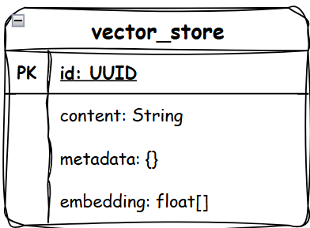
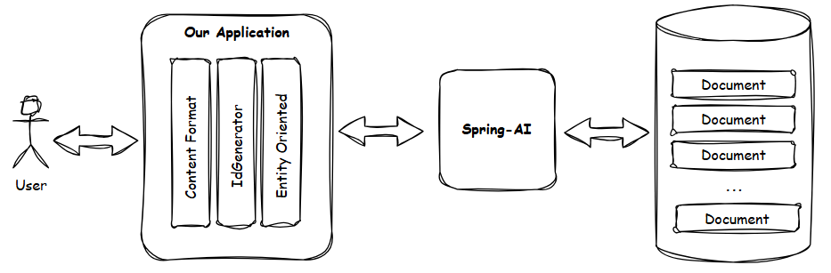

# Yas AI
Yas AI is a project that explores the power of **[Generative AI](https://en.wikipedia.org/wiki/Generative_artificial_intelligence)** through **[Spring AI](https://spring.io/projects/spring-ai)**. This project demonstrates various use cases for applying Generative AI to enhance application functionality.

---

## Tech Stack

Yas AI utilizes the following technologies:

- **Java**
- **Spring Boot**
- **Spring AI**
- **Apache Kafka**
- **PostgreSQL with pgvector**
- **Debezium**
- **Azure OpenAI API**

## How to Start

### 1. Start the Sample Data Instance
Ensure the sample data API is set to allow unauthorized access before proceeding.

### 2. Configure Azure OpenAI:
Place your key on **_.env_** file

**_.env_**
```properties
SPRING_AI_AZURE_OPENAI_API_KEY=${SPRING_AI_AZURE_OPENAI_API_KEY}
SPRING_AI_AZURE_OPENAI_ENDPOINT=${SPRING_AI_AZURE_OPENAI_ENDPOINT}
SPRING_AI_AZURE_OPENAI_EMBEDDING_OPTIONS_MODEL=${SPRING_AI_AZURE_OPENAI_EMBEDDING_OPTIONS_MODEL}
```

### 3. Start the Required Components
Run the following command to initialize and start the necessary instances:

```bash
./start-yas.sh
```

The script is to:
- Start docker compose.
- Create kafka connect.
- Create sample data.
---

## Features

### Product Recommendation
#### Similar Search
Implements vector-based search to identify and recommend similar products, leveraging the capabilities of Generative AI and Spring AI. This feature can help users discover products related to their preferences based on semantic similarity.
##### How data come to vector database?
Let's say we have a product and recommendation database. 
Our purpose is to make sure they are consistent, if product have any changes, 
recommendation must sync them. 

We are using Kafka Connect, Debezium to do that, below is the flow how product data come to 
recommendation.

<p style="text-align: center"></p>

1. There are changes on product data.
2. Debezium, Kafka Connect sent changes event to kafka topic (configured from kafka connect).
3. The **recommendation** service consumes message from the kafka topic.
4. The **recommendation** service send product data (in text) to 
OpenAI provider (Azure OpenAI, Ollama, etc) to get product embedding value.
5. OpenAI provider responses the embedding value.
6. The **recommendation** service saved product and its embedding value to database.

The utilization of Spring AI is in step **No4**, and **No5**. 
It's help us to integrate with OpenAI provider

##### How recommendation service handle data
We assume that you have known the data structure which SpringAI define. 

Generally, by default data will be saved as below table.
<p style="text-align: center"></p>


For simple functionality, using the guide from SpringAI we can create simple implementation as we need.

But the idea is the **vector_store** table is too generic, so we need to create our own **layer** 
to support our needs:

- Custom Content Formatter.
- Custom Id Generator.
- Make data entity oriented.



---

### AI Assistant
#### Intelligent Assistant Capabilities
Yas AI includes an intelligent assistant with several advanced AI functionalities:

- **Chat Completion**: Supports contextual chat completions chat.
- **Embedding**: Uses embeddings to process user's request and similar product search.
- **Function Calling**: Enables dynamic function calling based on AI-powered prompts.
- **Prompting**: Supports complex prompt designs for more refined AI interactions.


